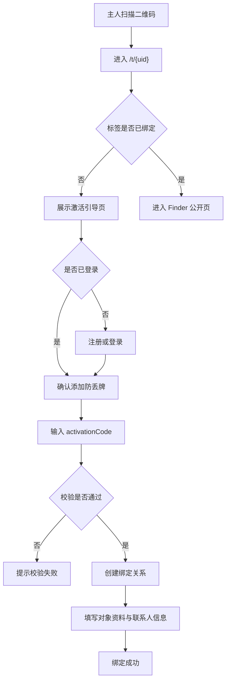
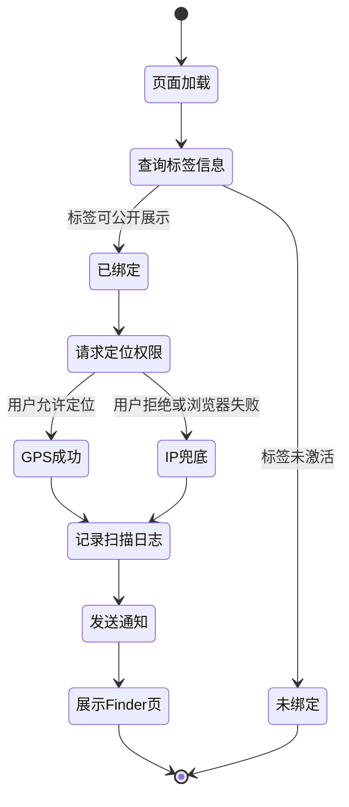
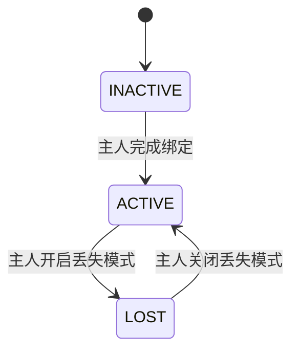
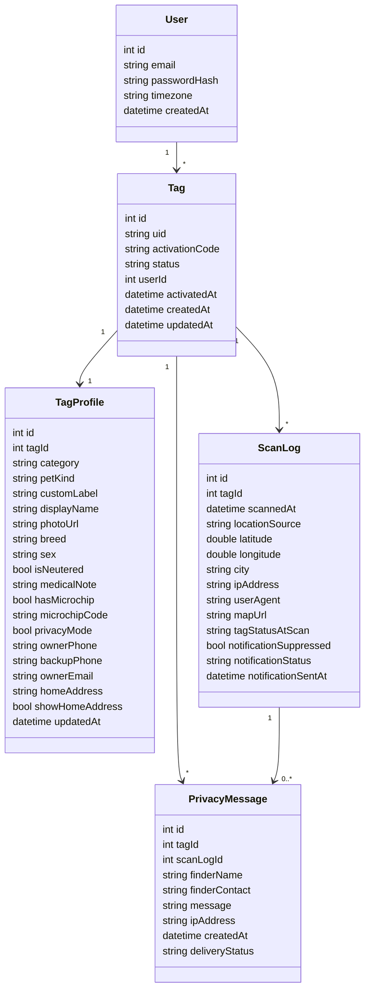

# SmartTag 核心流程与隐私策略设计文档

> 优先级：高
> 创建时间：2026-06-05 11:27
> 修改时间：2026-06-05 11:27
> 创建人：Codex

## 1. 概述

SmartTag 是一个基于二维码和 Web 页面的被动式防丢系统。

系统核心链路如下：

1. 主人扫描防丢牌二维码。
2. 主人注册或登录后，绑定该二维码并填写宠物或物品信息。
3. 发现者再次扫描同一个二维码时，直接看到主人已填写好的 Finder 页面。
4. 页面自动请求位置权限，并将扫描位置记录下来。
5. 系统向主人发送带地图链接的提醒邮件。

本设计文档重点明确以下 4 个后续开发基础：

- 激活与绑定流程
- 扫码页状态流转
- 数据表完整字段
- 通知与隐私策略

## 2. 需求口径确认

### 2.1 核心业务口径

- 同一块防丢牌有唯一二维码 `uid`。
- A 用户先绑定二维码并填写信息。
- B 用户之后扫描该二维码时，看到的是 A 用户已经绑定完成的公开信息页面。
- 一个账号可以绑定多个防丢牌。
- Finder 端无需注册、无需下载 App。
- Finder 页顶部是否显示红色丢失横幅，只取决于该标签是否被主人开启 `LOST` 状态。
- 项目需要独立首页，用于品牌介绍、产品价值说明、跳转标签功能页与回链官网体系。
- 项目需要支持多语言，首版至少提供中文、英文、日文。

### 2.2 统一数据模型口径

不再单独限定为“宠物表”，而是统一为“绑定对象资料”模型，兼容以下场景：

- 猫
- 狗
- 其他宠物
- 自定义物品名称

建议用“对象类型 + 展示资料”的方式建模，而不是把所有字段都强绑定到宠物语义。

例如：

- `category = PET | ITEM`
- `petKind = CAT | DOG | OTHER`
- `customLabel = Backpack / Keys / Luna`

## 3. 业务流程设计

### 3.1 激活与绑定流程



### 3.2 激活规则

- 二维码短链只负责定位到标签 `uid`。
- 真正绑定时仍要求主人输入包装上的 `activationCode`，用于防止别人抢先绑定。
- 如果扫码时用户已登录，则直接进入“是否添加此防丢牌”确认流程。
- 如果标签已绑定：
  - 当前用户是拥有者，则进入管理页。
  - 当前用户不是拥有者，则进入 Finder 公开页。

### 3.3 Finder 扫码状态流转



### 3.4 Tag 状态设计



状态说明：

- `INACTIVE`：标签未绑定或未完成初始化。
- `ACTIVE`：标签已绑定，Finder 可见普通公开页。
- `LOST`：标签已绑定，Finder 页顶部显示大红横幅 `I AM LOST, PLEASE HELP!`。

## 4. 页面与交互设计

### 4.1 主人端页面

建议最少拆成以下页面：

| 页面 | 用途 | 关键动作 |
|------|------|----------|
| 首页 | 品牌展示与功能入口 | 查看品牌内容、跳转登录/扫码相关页面 |
| 激活引导页 | 承接首次扫码 | 登录、注册、添加防丢牌 |
| 激活校验页 | 输入包装校验码 | 校验 `activationCode` |
| 资料编辑页 | 填写展示信息 | 上传图片、编辑名称、联系方式、隐私模式 |
| 标签列表页 | 查看账号下全部防丢牌 | 进入单个标签详情、查看状态、继续编辑 |
| 标签管理页 | 查看状态与扫描历史 | 开关 `LOST`、查看最近扫描记录 |

### 4.1.3 多标签管理

由于一个账号可以绑定多个防丢牌，主人端不能只设计“单标签详情页”，还需要明确一层标签列表管理页。

推荐主人端结构如下：

1. 标签列表页
   - 显示当前账号下全部防丢牌
   - 展示每个标签的名称、状态、图片缩略图、最近扫描时间
   - 支持进入单个标签详情
2. 标签详情页
   - 查看单个标签的资料、状态、扫描历史
   - 切换 `ACTIVE / LOST`
   - 进入资料编辑页

这样更符合真实使用场景，例如一个用户同时为两只宠物或多个物品绑定标签。

### 4.1.1 首页定位

首页不是 Finder 页，也不是后台入口页，而是面向首次访问用户的品牌门户页。

首页承担以下职责：

1. 解释 SmartTag 是什么。
2. 说明“绑定后别人扫码可以帮你找回”的核心机制。
3. 建立品牌信任感。
4. 提供进入登录、注册、激活、防丢牌介绍等页面的入口。
5. 与官网整体风格保持一致，并保留跳回官网的明显入口。

### 4.1.2 首页信息架构建议

参考 [meouwow 首页](https://meouwow.com/) 的表达方式，SmartTag 首页建议走“轻销售、重信任、重情绪价值”的结构，但内容要围绕“防丢找回”而不是宠物健康。

推荐区块如下：

1. Hero 首屏
   - 主标题：一句话解释产品价值
   - 副标题：强调无需电池、无需 App、扫码即联系
   - 主按钮：`立即激活` / `了解如何使用`
   - 次按钮：`返回官网`
2. 产品机制区
   - 用 3 步说明 `主人绑定 -> 发现者扫码 -> 主人收到提醒`
3. 使用场景区
   - 宠物
   - 背包/钥匙/行李等物品
4. 隐私与安心区
   - 解释 Direct Contact 与 Privacy Mode
5. 丢失模式区
   - 展示 Finder 页红色横幅效果与提醒能力
6. FAQ 区
   - 是否需要充电
   - 是否需要 App
   - 找到后如何联系
   - 支持哪些语言
7. 页脚
   - 联系方式
   - 多语言切换
   - 返回官网

### 4.2 Finder 页结构

Finder 页遵循 `Mobile First`，尽量首屏完成主要信息与操作。

推荐结构：

1. 顶部状态区
   - `LOST` 时显示巨大的红色横幅 `I AM LOST, PLEASE HELP!`
   - 非 `LOST` 时不展示横幅
2. 主视觉区
   - 对象图片
   - 显示名称
   - 类型标签，例如 `Dog`、`Cat`、`Item`
3. 警示信息区
   - 医疗备注高亮显示
   - 微芯片信息
4. 联系操作区
   - `Call Owner`
   - `Email Owner` 或 `给主人留言`
   - `Show Location`

### 4.3 Show Location 定义

`Show Location` 的语义按当前口径定义为：

- 打开地图应用
- 目标定位为“发现者当前所在位置”
- 用于发现者确认自己当前位置或向第三方说明位置

实现建议：

- 优先打开 `https://maps.google.com/?q={lat},{lng}`
- 如果当前扫描只拿到了 IP 城市级位置，则展示城市级提示，不承诺精确定位

### 4.4 多语言设计

首版明确支持以下语言：

- 简体中文 `zh-CN`
- 英文 `en`
- 日文 `ja`

多语言覆盖范围建议如下：

| 范围 | 是否必须多语言 | 说明 |
|------|----------------|------|
| 首页文案 | 是 | 品牌价值、FAQ、按钮文案 |
| 主人端表单 | 是 | 注册、激活、资料编辑 |
| Finder 页 | 是 | 按钮、提示语、隐私说明、丢失横幅 |
| 邮件通知 | 是 | 按主人账户语言发送 |
| 错误提示 | 是 | 表单校验、扫描失败、激活失败 |

语言策略建议：

1. 首次进入首页时根据浏览器语言自动匹配。
2. 用户可手动切换语言。
3. 主人账户保存一个默认语言，用于后台和邮件通知。
4. Finder 页优先使用浏览器语言；若无对应语言则回退英文。

## 5. 隐私模式设计

### 5.1 设计目标

隐私模式的目标不是完全隐藏联系人，而是在不暴露主人真实电话和邮箱的前提下，让 Finder 仍然能完成联系动作。

### 5.2 简化版隐私策略

建议首版只保留 2 种模式：

| 模式 | 展示内容 | 用户体验 | 适用场景 |
|------|----------|----------|----------|
| Direct Contact | 直接显示主联系电话，可点击拨号 | 联系最快 | 愿意公开电话的主人 |
| Privacy Mode | 不显示电话，展示留言表单和邮件转发动作 | 更安全 | 希望避免骚扰的主人 |

### 5.3 Privacy Mode 推荐交互

Finder 端不显示以下敏感信息：

- 主电话
- 备用电话
- 家庭地址
- 主人真实邮箱

Finder 端显示以下可操作入口：

- `给主人留言`
- `Email Owner`

其中建议做成同一个“匿名转发联系”能力：

1. Finder 填写一段留言。
2. 系统将留言、扫描时间、扫描位置、设备信息一起发邮件给主人。
3. 主人收到后自行决定是否回拨或回信。

留言表单建议字段：

| 字段 | 必填 | 说明 |
|------|------|------|
| message | 是 | Finder 留言内容 |
| finderName | 否 | 方便主人称呼 |
| finderContact | 否 | 例如手机号或邮箱，供主人回联 |

### 5.4 Privacy Mode 风控建议

- 同一 `tagId + IP` 在 1 分钟内只允许触发一次通知。
- 同一 `tagId + IP` 在 5 分钟内限制留言提交次数。
- 留言内容做基础敏感词和超长限制。
- 所有真实联系方式只在主人端展示。

## 6. 通知与定位策略

### 6.1 定位策略

Finder 页加载后立即请求定位：

1. 如果用户允许：
   - 获取 GPS 坐标
   - 记录 `locationSource = GPS`
   - 生成精确地图链接
2. 如果用户拒绝或失败：
   - 获取请求 IP
   - 解析城市级位置
   - 记录 `locationSource = IP`
   - 生成城市级或近似地图信息

### 6.2 邮件通知策略

触发时机：

- Finder 首次扫描成功记录后
- 或 Privacy Mode 下 Finder 提交留言后

邮件建议内容：

- 标签显示名称
- 扫描时间
- 定位来源 `GPS/IP`
- 大概位置
- 地图链接
- 设备信息
- 是否处于 `LOST` 状态
- Finder 留言内容（若有）

### 6.3 通知去重策略

建议以“防骚扰”和“避免重复发信”为目标，首版规则如下：

- 相同 `tagId + IP` 在 1 分钟内重复扫描，只发一封扫描提醒邮件。
- 如果第二次扫描拿到了更高精度的 GPS，可更新扫描日志，但不重复发信。
- 留言提交与纯扫描提醒分开计数，避免用户正常留言被误拦截。

## 7. 数据模型设计

### 7.1 设计原则

- `Tag` 表示物理防丢牌本身。
- `TagProfile` 表示这块牌当前绑定展示给 Finder 的对象资料。
- `ScanLog` 表示每次扫描及定位记录。
- `PrivacyMessage` 表示 Privacy Mode 下的匿名转发留言。

### 7.2 推荐实体关系



### 7.3 关键字段建议

#### User

| 字段 | 类型 | 说明 |
|------|------|------|
| id | Int | 主键 |
| email | String | 登录邮箱 |
| passwordHash | String | 密码哈希 |
| timezone | String | 主人时区，用于邮件时间展示 |
| createdAt | DateTime | 创建时间 |

#### Tag

| 字段 | 类型 | 说明 |
|------|------|------|
| id | Int | 主键 |
| uid | String | 二维码短链唯一标识 |
| activationCode | String | 包装校验码 |
| status | String | `INACTIVE / ACTIVE / LOST` |
| userId | Int | 所属主人 |
| activatedAt | DateTime | 绑定成功时间 |
| createdAt | DateTime | 创建时间 |
| updatedAt | DateTime | 更新时间 |

#### TagProfile

| 字段 | 类型 | 说明 |
|------|------|------|
| tagId | Int | 对应标签 |
| category | String | `PET / ITEM` |
| petKind | String | `CAT / DOG / OTHER`，仅宠物场景使用 |
| customLabel | String | 自定义物品名称或补充标签 |
| displayName | String | Finder 页展示名 |
| photoUrl | String | 图片地址 |
| breed | String | 品种或类型描述 |
| sex | String | 性别，可空 |
| isNeutered | Boolean | 是否绝育，可空 |
| medicalNote | String | 医疗备注 |
| hasMicrochip | Boolean | 是否有芯片 |
| microchipCode | String | 芯片编号 |
| privacyMode | Boolean | 是否启用隐私模式 |
| ownerPhone | String | 主电话 |
| backupPhone | String | 备用电话 |
| ownerEmail | String | 联系邮箱 |
| homeAddress | String | 家庭地址 |
| showHomeAddress | Boolean | 是否公开地址 |
| updatedAt | DateTime | 更新时间 |

#### ScanLog

| 字段 | 类型 | 说明 |
|------|------|------|
| tagId | Int | 对应标签 |
| scannedAt | DateTime | 扫描时间 |
| locationSource | String | `GPS / IP` |
| latitude | Float | 纬度，可空 |
| longitude | Float | 经度，可空 |
| city | String | 城市级位置 |
| ipAddress | String | 请求 IP |
| userAgent | String | 设备信息 |
| mapUrl | String | 生成时的地图链接快照 |
| tagStatusAtScan | String | 扫描时标签状态 |
| notificationSuppressed | Boolean | 是否因去重而未发信 |
| notificationStatus | String | `PENDING / SENT / FAILED / SKIPPED` |
| notificationSentAt | DateTime | 发信时间 |

#### PrivacyMessage

| 字段 | 类型 | 说明 |
|------|------|------|
| tagId | Int | 对应标签 |
| scanLogId | Int | 关联扫描记录，可空 |
| finderName | String | Finder 称呼 |
| finderContact | String | Finder 留下的联系方式 |
| message | String | 留言内容 |
| ipAddress | String | 留言来源 IP |
| createdAt | DateTime | 创建时间 |
| deliveryStatus | String | `PENDING / SENT / FAILED` |

## 8. 页面与接口拆分建议

### 8.1 页面建议

后续前端可以按以下最小页面集推进：

| 页面路由 | 用途 |
|----------|------|
| `/dashboard/tags` | 当前账号的防丢牌列表 |
| `/t/[uid]` | 二维码统一入口，自动判断进入激活态、管理态或 Finder 态 |
| `/auth/login` | 登录 |
| `/auth/register` | 注册 |
| `/tags/[uid]/activate` | 校验码绑定 |
| `/tags/[uid]/edit` | 编辑资料 |
| `/dashboard/tags/[uid]` | 标签详情与扫描历史 |

### 8.2 接口建议

| 接口 | 用途 |
|------|------|
| `POST /api/auth/register` | 注册 |
| `POST /api/auth/login` | 登录 |
| `POST /api/tags/activate` | 校验二维码与激活码，建立绑定 |
| `GET /api/tags/public/:uid` | 获取 Finder 页公开资料 |
| `POST /api/tags/public/:uid/scan` | 记录扫描日志并触发通知 |
| `POST /api/tags/public/:uid/message` | Privacy Mode 匿名留言 |
| `PATCH /api/tags/:id/status` | 主人切换 `ACTIVE/LOST` |
| `PATCH /api/tags/:id/profile` | 更新展示资料 |
| `GET /api/tags/:id/scans` | 查看扫描历史 |

## 9. Prisma Schema 是什么

Prisma Schema 可以理解为“数据库结构说明书”，是 Prisma ORM 用来定义数据模型、字段类型、表关系和索引的配置文件。

如果后面项目使用 Prisma，那么我们在这里整理出来的 `User / Tag / TagProfile / ScanLog / PrivacyMessage`，最终都会被写成 `schema.prisma` 里的模型定义，例如：

```prisma
model Tag {
  id             Int        @id @default(autoincrement())
  uid            String     @unique
  activationCode String
  status         String
  userId         Int
  activatedAt    DateTime?
  createdAt      DateTime   @default(now())
  updatedAt      DateTime   @updatedAt

  user           User       @relation(fields: [userId], references: [id])
  profile        TagProfile?
  scans          ScanLog[]
}
```

它的作用主要有 3 个：

1. 明确数据库有哪些表和字段。
2. 明确表与表之间的关系。
3. 让 Prisma 自动生成可在后端直接调用的数据库访问代码。

## 10. 后续开发建议

建议后续按以下顺序推进：

1. 先确定 `schema.prisma` 与接口契约。
2. 再做二维码入口页 `/t/[uid]` 的状态判断。
3. 完成主人端激活、编辑、切换 `LOST`。
4. 完成 Finder 页公开展示、定位上报、通知链路。
5. 最后补扫描历史和 Privacy Mode 留言能力。

这样可以先跑通“绑定 -> 扫码查看 -> 定位通知”主闭环，再补增强能力。
