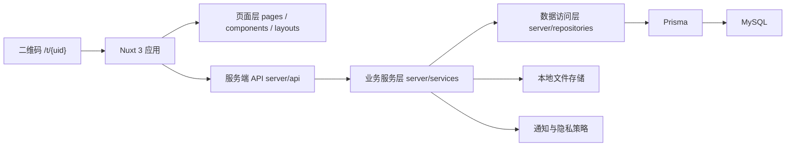
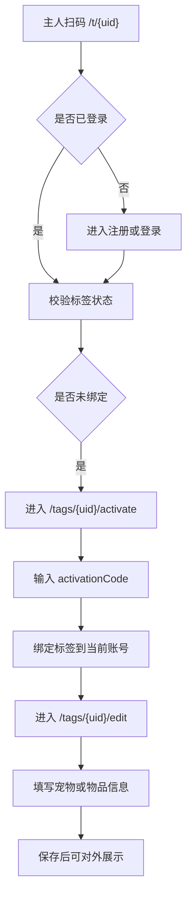
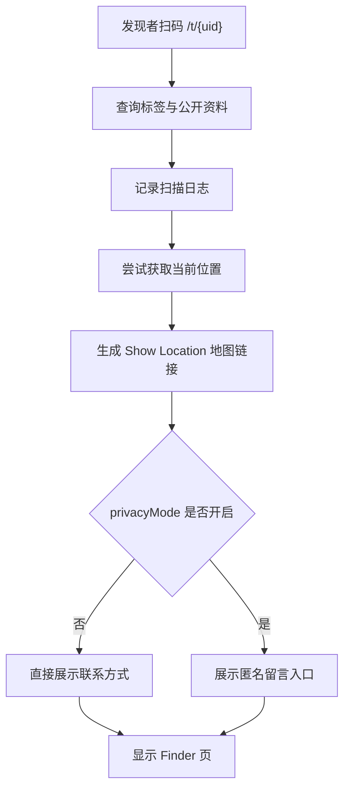

# SmartTag 技术方案

> 优先级：高
> 创建时间：2026-06-05 11:33
> 修改时间：2026-06-05 16:55
> 创建人：Codex

## 1. 文档目标

本文档用于把 SmartTag 首版需求收敛为一套可直接进入开发的 Vue 技术方案，并与以下文档保持一致：

- [20260605_1126_设计_SmartTag核心流程与隐私策略.md](D:\Demo\anti-lost-tag\docs\02_设计\20260605_1126_设计_SmartTag核心流程与隐私策略.md)
- [20260605_1146_设计_SmartTag接口设计.md](D:\Demo\anti-lost-tag\docs\02_设计\20260605_1146_设计_SmartTag接口设计.md)
- [20260605_1220_设计_SmartTag页面清单与状态流转.md](D:\Demo\anti-lost-tag\docs\02_设计\20260605_1220_设计_SmartTag页面清单与状态流转.md)
- [20260605_1255_设计_SmartTagOpenAPI.yaml](D:\Demo\anti-lost-tag\docs\02_设计\20260605_1255_设计_SmartTagOpenAPI.yaml)
- [20260605_1618_设计_SmartTag认证联调模式补充.md](D:\Demo\anti-lost-tag\docs\02_设计\20260605_1618_设计_SmartTag认证联调模式补充.md)

本文档重点解决以下问题：

1. 首版使用什么 Vue 技术栈。
2. 页面、接口、Prisma Schema 如何对齐。
3. 扫码页、绑定页、管理页如何落到 Nuxt 3 结构。
4. 本地开发阶段的认证、通知、隐私、多语言如何实现。
5. 后续页面、接口和数据库应该按什么顺序开工。

## 2. 已冻结的首版范围

### 2.1 业务范围

首版围绕“二维码防丢牌”展开，核心链路如下：

1. 主人扫描二维码，注册或登录账号。
2. 主人激活并绑定防丢牌，填写宠物或物品资料。
3. 发现者扫描同一个二维码，看到主人已绑定的公开资料。
4. 主人可以开启 `LOST` 状态，Finder 页顶部显示红色横幅：
   `I AM LOST, PLEASE HELP!`
5. 一个账号可以绑定多个防丢牌。

### 2.2 数据建模范围

首版不拆独立 `pets` 表，而是统一使用兼容宠物与物品的资料结构：

1. `category` 区分 `PET` / `ITEM`
2. `petKind` 兼容 `CAT` / `DOG` / `OTHER`
3. `customLabel` 支持自定义物品名称
4. `displayName` 统一作为 Finder 页展示主标题

### 2.3 认证联调范围

当前阶段全部以本地开发联调为准：

1. 只做邮箱密码登录
2. 做邮箱注册验证
3. 做找回密码
4. 不接真实邮件厂商
5. 邮箱验证固定验证码为 `123456`
6. 找回密码固定验证码为 `123456`

### 2.4 多语言范围

首版支持三种语言：

1. 简体中文 `zh-CN`
2. 英文 `en`
3. 日文 `ja`

### 2.5 当前环境范围

当前先统一为本地开发模式：

1. 本地运行 Nuxt 3
2. 本地连接 MySQL
3. Redis 首版可不接，接口层保留兼容位
4. 对象存储先走本地 provider
5. GeoIP 先关闭或降级为空实现
6. 邮件发送先关闭，保留 mock 响应

## 3. 技术选型

### 3.1 首版推荐技术栈

| 层级 | 选型 | 说明 |
|------|------|------|
| Web 框架 | Nuxt 3 | 基于 Vue，兼顾 SSR、路由、服务端 API、首页 SEO |
| 语言 | TypeScript | 统一页面、接口、数据模型类型 |
| UI | Vue 3 + SCSS | 适合移动端表单和品牌首页表达 |
| 状态管理 | Pinia | 承载登录态、标签列表、激活流程临时态 |
| 多语言 | `@nuxtjs/i18n` | 统一中英日文案和路由前缀 |
| 服务端 | Nitro Server API | 与 Nuxt 同仓开发，适合首版快速推进 |
| ORM | Prisma | 对齐 `schema.prisma` 与 OpenAPI 数据结构 |
| 数据库 | MySQL 8.0 | 结构清晰，适合用户、标签、扫描日志、隐私留言 |
| 会话 | Cookie Session | 主人端登录态实现简单，首版足够 |
| 上传 | 本地文件存储 | 先打通页面与接口，后续再替换为 R2/S3 |

### 3.2 为什么用 Nuxt 3

选择 Nuxt 3 的主要原因：

1. 首页、认证页、扫码页、管理页、服务端接口可以统一在一个仓库里。
2. 公开 Finder 页和品牌首页天然适合 SSR / SEO。
3. Nuxt 自带路由和服务端能力，能减少首版基础设施搭建成本。
4. 后续如果要拆前后端，当前分层也足够平滑迁移。

## 4. 系统结构

### 4.1 总体架构



### 4.2 目录结构建议

```text
anti-lost-tag/
├─ assets/
│  └─ styles/
├─ components/
├─ composables/
├─ docs/
├─ i18n/
│  └─ locales/
│     ├─ zh-CN.json
│     ├─ en.json
│     └─ ja.json
├─ layouts/
├─ pages/
├─ prisma/
│  └─ schema.prisma
├─ public/
├─ rules/
├─ server/
│  ├─ api/
│  ├─ repositories/
│  ├─ services/
│  └─ utils/
├─ stores/
├─ app.vue
├─ nuxt.config.ts
├─ package.json
└─ tsconfig.json
```

### 4.3 分层职责

1. `pages/`：10 个技术路由页面。
2. `components/`：首页区块、表单、状态卡片、Finder 展示卡片。
3. `stores/`：用户态、标签列表态、激活流程态。
4. `server/api/`：按 OpenAPI 拆分接口入口。
5. `server/services/`：认证、标签、扫描日志、隐私留言业务。
6. `server/repositories/`：Prisma 查询和写入封装。
7. `server/utils/`：session、密码 hash、本地上传、mock 验证码等基础能力。

## 5. 页面方案

### 5.1 页面数量结论

首版按技术路由统计，一共实现 **10 个页面**：

1. `/`
2. `/t/[uid]`
3. `/auth/login`
4. `/auth/register`
5. `/auth/forgot-password`
6. `/auth/reset-password`
7. `/tags/[uid]/activate`
8. `/tags/[uid]/edit`
9. `/dashboard/tags`
10. `/dashboard/tags/[uid]`

### 5.2 首页方案

首页信息架构直接参考 [Meouwow 官网](https://meouwow.com/) 的表达方式，但内容替换为 SmartTag 品牌。

建议区块：

1. Hero 首屏
2. Manifesto 品牌宣言
3. Mission / Vision
4. Core Values
5. 产品机制说明
6. 丢失找回场景区
7. 隐私与安心区
8. 品牌故事
9. FAQ
10. Footer

首页承担的技术职责：

1. 提供多语言切换。
2. 提供登录、注册、激活入口。
3. 提供 SEO 友好的品牌展示内容。
4. 不承载 Finder 业务逻辑。

### 5.3 二维码入口页状态

`/t/[uid]` 是首版最关键的页面，内部需要覆盖 7 种状态：

1. `LOADING`
2. `TAG_NOT_FOUND`
3. `TAG_INACTIVE_GUEST`
4. `TAG_INACTIVE_OWNER`
5. `OWNER_REDIRECT`
6. `FINDER_ACTIVE`
7. `FINDER_LOST`

其中：

1. 主人扫码未登录时，进入认证或激活链路。
2. 主人扫码已登录且是所有者时，可跳转管理或编辑页面。
3. 发现者扫码时，展示 Finder 公开信息页。
4. 当标签状态为 `LOST` 时，Finder 页顶部显示醒目的红色横幅：
   `I AM LOST, PLEASE HELP!`

## 6. 核心业务流

### 6.1 激活与绑定流程



### 6.2 Finder 扫码流程



### 6.3 Show Location 约定

`Show Location` 不展示主人住址，也不做宠物实时定位。

当前约定为：

1. 打开地图链接。
2. 地图定位点为“发现者当前设备位置”。
3. 目的在于帮助发现者确认自己所在位置并更容易描述发现地点。

### 6.4 多标签管理流程

一个账号下允许绑定多个防丢牌，因此主人端需要支持：

1. 标签列表页查看全部标签。
2. 从列表进入单个标签详情页。
3. 各标签独立编辑资料、状态、隐私设置和扫描记录。

## 7. 数据结构方案

### 7.1 Prisma 模型对齐结论

当前 `schema.prisma` 已对齐首版核心模型：

1. `User`
2. `Tag`
3. `TagProfile`
4. `ScanLog`
5. `PrivacyMessage`

### 7.2 关键枚举

| 枚举 | 说明 |
|------|------|
| `PreferredLocale` | `ZH_CN` / `EN` / `JA` |
| `TagStatus` | `INACTIVE` / `ACTIVE` / `LOST` |
| `ProfileCategory` | `PET` / `ITEM` |
| `PetKind` | `CAT` / `DOG` / `OTHER` |
| `ProfileSex` | `MALE` / `FEMALE` / `UNKNOWN` |
| `LocationSource` | `GPS` / `IP` |
| `NotificationStatus` | 扫描通知发送状态 |
| `DeliveryStatus` | 隐私留言转发状态 |

### 7.3 核心表职责

`User`

1. 存储账号、密码哈希、邮箱验证状态、语言偏好。
2. 与多个 `Tag` 建立一对多关系。

`Tag`

1. 存储 `uid`、`activationCode`、标签状态。
2. 通过 `userId` 绑定到主人账户。
3. 一个 `Tag` 对应一份 `TagProfile`。

`TagProfile`

1. 统一兼容宠物和物品资料。
2. `privacyMode` 控制 Finder 页展示策略。
3. 直接承载电话、备用电话、通知邮箱、地址等资料。

`ScanLog`

1. 记录每次扫码时间、来源、位置、IP、User-Agent。
2. 记录扫码时标签状态。
3. 记录是否触发通知或被去重抑制。

`PrivacyMessage`

1. 记录发现者匿名留言。
2. 可关联到某次扫码日志。
3. 首版先只做站内落库，不做真实邮件转发。

### 7.4 扫描日志补充字段

首版按建议保留以下字段：

1. `tagStatusAtScan`
2. `notificationSuppressed`
3. `notificationStatus`
4. `notificationSentAt`
5. `dedupeKey`

### 7.5 去重与通知策略

当前建议：

1. 同一 `tagId + ipAddress` 在 1 分钟内重复扫码，仍记录日志。
2. 但这类重复扫码不重复触发通知。
3. `notificationSuppressed = true` 用于标记被抑制的通知。

## 8. 认证方案

### 8.1 首版认证能力

1. 注册
2. 邮箱验证
3. 登录
4. 忘记密码
5. 重置密码
6. 登出

### 8.2 当前认证策略

首版先采用 Cookie Session：

1. 登录成功后写入服务端 Session。
2. 主人端页面统一通过鉴权中间件保护。
3. Finder 页保持匿名可访问。

### 8.3 mock 验证码策略

当前阶段不引入真实验证码表和邮件投递链路。

约定如下：

1. `POST /api/auth/verify-email/request` 返回受理成功。
2. `POST /api/auth/verify-email/confirm` 使用 `email + code` 校验。
3. `POST /api/auth/forgot-password` 返回受理成功。
4. `POST /api/auth/reset-password` 使用 `email + code + newPassword` 校验。
5. 正确验证码固定为 `123456`。

### 8.4 数据落地约束

当前 `User` 模型保留：

1. `email`
2. `passwordHash`
3. `emailVerifiedAt`
4. `preferredLocale`
5. `timezone`

当前不新增：

1. `EmailVerificationToken`
2. `PasswordResetToken`

## 9. 隐私、公开信息与通知

### 9.1 隐私模式首版设计

`privacyMode = false`

1. Finder 页直接展示主人公开联系方式。
2. 适合主人愿意直接让发现者电话联系的场景。

`privacyMode = true`

1. Finder 页不直接展示完整联系方式。
2. Finder 通过匿名留言表单提交信息。
3. 后端落库到 `PrivacyMessage`。
4. 当前阶段不真实发邮件，后续可接通知渠道。

### 9.2 公开字段原则

Finder 页只返回公开信息，不返回敏感内部字段。

建议公开：

1. `displayName`
2. `photoUrl`
3. `breed`
4. `medicalNote`
5. `rewardText`
6. `showHomeAddress = true` 时的地址
7. 根据隐私模式决定是否公开电话和通知邮箱

### 9.3 丢失模式展示

当标签状态为 `LOST` 时：

1. Finder 页顶部显示大红横幅。
2. 文案固定为 `I AM LOST, PLEASE HELP!`
3. 主视觉优先级高于普通资料信息。

## 10. 多语言方案

### 10.1 语言目录

```text
i18n/
  locales/
    zh-CN.json
    en.json
    ja.json
```

### 10.2 首版必须国际化的内容

1. 首页全部文案
2. 登录、注册、忘记密码、重置密码页
3. 激活页和资料编辑页
4. Finder 页固定状态文案
5. 丢失横幅文案
6. 隐私模式说明
7. 管理页按钮与状态标签

### 10.3 语言优先级

建议优先级如下：

1. URL 语言前缀
2. 用户 `preferredLocale`
3. 浏览器 `Accept-Language`
4. 默认回退 `zh-CN`

## 11. OpenAPI 与 Schema 对齐要求

### 11.1 当前对齐目标

后续开发必须保证以下三者统一：

1. `docs/02_设计/20260605_1255_设计_SmartTagOpenAPI.yaml`
2. `prisma/schema.prisma`
3. Nuxt `server/api` 实际请求与响应结构

### 11.2 已确认的认证接口

1. `POST /api/auth/register`
2. `POST /api/auth/login`
3. `POST /api/auth/logout`
4. `POST /api/auth/verify-email/request`
5. `POST /api/auth/verify-email/confirm`
6. `POST /api/auth/forgot-password`
7. `POST /api/auth/reset-password`

### 11.3 已确认的业务接口方向

1. 公共 Finder 查询接口
2. 标签激活接口
3. 标签编辑接口
4. 标签列表与详情接口
5. 扫描日志查询接口
6. 隐私留言提交接口
7. 上传接口

## 12. 本地开发环境约定

### 12.1 环境变量结论

当前 `.env.example` 以本地开发为准，核心变量如下：

| 变量 | 用途 |
|------|------|
| `APP_URL` | 本地站点地址 |
| `DATABASE_URL` | MySQL 连接串 |
| `SESSION_SECRET` | Session 签名 |
| `DEFAULT_LOCALE` | 默认语言 |
| `AUTH_MOCK_CODE` | 固定验证码，当前为 `123456` |
| `AUTH_ENABLE_EMAIL_VENDOR` | 当前为 `false` |
| `STORAGE_PROVIDER` | 当前默认 `local` |
| `GEOIP_PROVIDER` | 当前默认 `none` |
| `MAIL_PROVIDER` | 当前默认 `none` |

### 12.2 本地基础设施建议

首版本地开发建议：

1. Nuxt 3 本地运行在 `http://localhost:3000`
2. MySQL 本地运行在 `127.0.0.1:3306`
3. 上传目录走本地磁盘
4. Redis 暂不强依赖

## 13. 实施顺序

### 13.1 第一阶段

1. 初始化 Nuxt 3 根项目
2. 接入 TypeScript、Pinia、`@nuxtjs/i18n`
3. 建立 10 个页面路由骨架
4. 接入 Prisma 与本地 MySQL

### 13.2 第二阶段

1. 实现认证接口与认证页面
2. 实现 `/t/[uid]` 状态流转
3. 实现标签激活、编辑、列表、详情接口
4. 对齐 OpenAPI 与实际 DTO

### 13.3 第三阶段

1. 实现扫描日志记录
2. 实现隐私留言落库
3. 实现本地上传
4. 完善首页品牌内容和多语言文案

## 14. 风险与约束

1. 当前验证码固定为 `123456`，只适合本地开发，不可直接上线。
2. 当前未接真实邮件和消息渠道，通知能力仅停留在接口与数据结构预留阶段。
3. 当前 Redis 为可选项，因此扫描去重首版需要允许数据库兜底实现。
4. 首页参考 Meouwow 只能借鉴信息架构与表达节奏，不能照搬对方品牌素材。

## 15. 结论

SmartTag 首版当前应统一采用以下方案：

- `Nuxt 3 + Vue 3 + TypeScript + Pinia + @nuxtjs/i18n + Prisma + MySQL`

并遵守以下实施口径：

1. 当前全部先按本地开发模式推进。
2. 认证链路使用 mock 验证码 `123456`。
3. 一个账号可绑定多个防丢牌。
4. 页面总数按 10 个技术路由实现。
5. 接口定义、Prisma 模型、Nuxt 页面状态机必须同步维护。

在这套口径下，后面继续做页面、接口和 Prisma schema 时就有统一真相源，可以直接进入代码实现。
