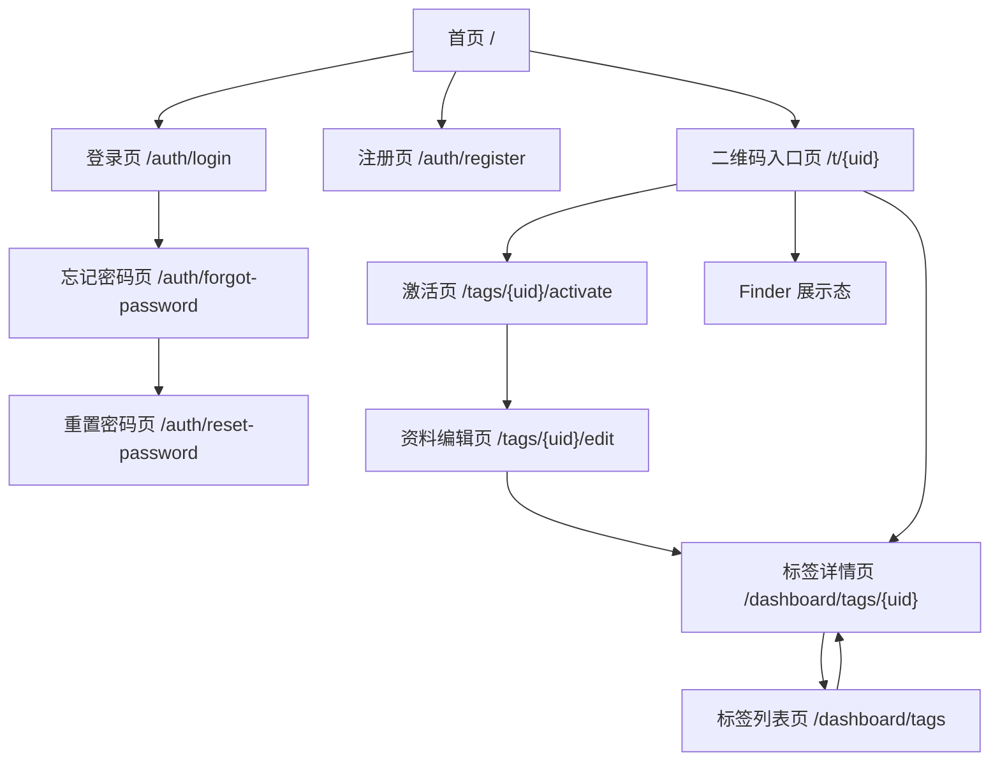
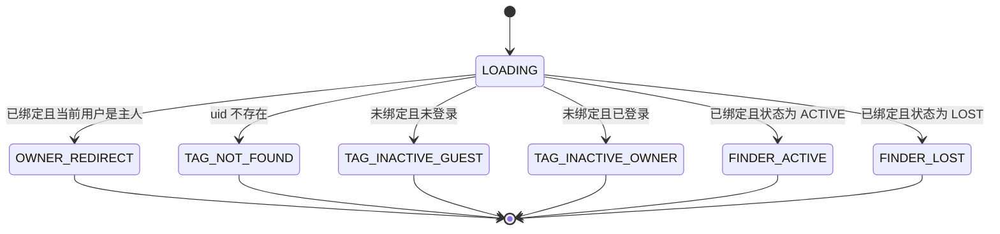
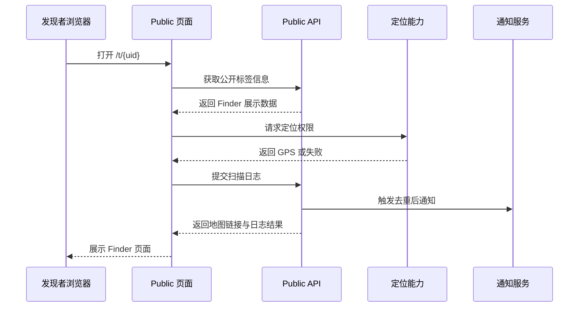
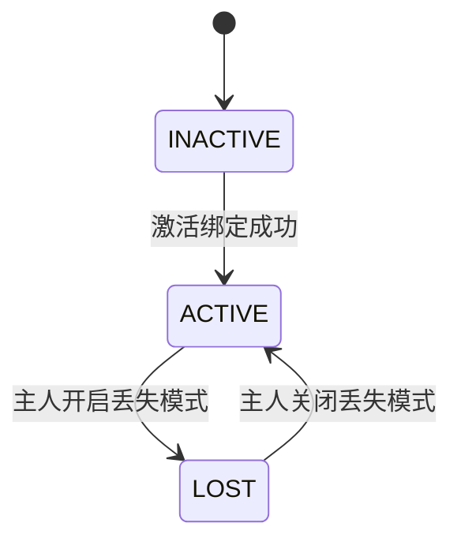
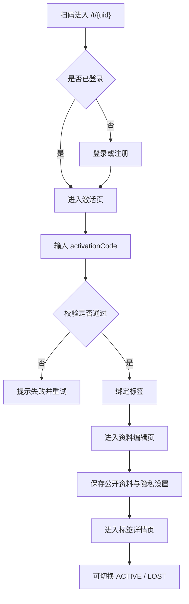

# SmartTag 页面清单与状态流转

> 优先级：高
> 创建时间：2026-06-05 12:20
> 修改时间：2026-06-05 12:20
> 创建人：Codex

## 1. 文档目标

本文档用于在进入 OpenAPI / Swagger 规范前，先冻结 SmartTag 首版的页面清单、路由结构、页面职责与关键状态流转。

本文档与以下设计保持一致：

- [20260605_1126_设计_SmartTag核心流程与隐私策略.md](D:\Demo\anti-lost-tag\docs\02_设计\20260605_1126_设计_SmartTag核心流程与隐私策略.md)
- [20260605_1133_设计_SmartTag技术方案.md](D:\Demo\anti-lost-tag\docs\02_设计\20260605_1133_设计_SmartTag技术方案.md)
- [20260605_1146_设计_SmartTag接口设计.md](D:\Demo\anti-lost-tag\docs\02_设计\20260605_1146_设计_SmartTag接口设计.md)

## 2. 页面数量结论

首版按技术路由统计，建议实现 **10 个页面**。

需要注意：

1. 这里的“10 个页面”指的是前端路由层面的页面数量。
2. 实际产品状态数会多于 10，因为二维码入口页 `/t/[uid]` 会根据标签绑定状态、是否登录、是否是主人、是否开启丢失模式而展示不同内容。
3. 多语言使用 Nuxt i18n 路由前缀，不额外增加页面概念数量。

## 3. 页面路由清单

### 3.1 首版页面总表

| 序号 | 路由 | 页面名称 | 访问角色 | 页面职责 |
|------|------|----------|----------|----------|
| 1 | `/` | 首页 | 全部用户 | 品牌展示、产品机制说明、FAQ、登录注册与激活入口 |
| 2 | `/t/[uid]` | 二维码统一入口页 | 主人 / 发现者 | 按标签状态与访问身份自动分流 |
| 3 | `/auth/login` | 登录页 | 主人 | 邮箱密码登录 |
| 4 | `/auth/register` | 注册页 | 主人 | 注册账户并保存语言偏好 |
| 5 | `/auth/forgot-password` | 忘记密码页 | 主人 | 输入邮箱并进入重置密码流程 |
| 6 | `/auth/reset-password` | 重置密码页 | 主人 | 输入验证码 `123456` 并设置新密码 |
| 7 | `/tags/[uid]/activate` | 激活页 | 主人 | 输入 `activationCode` 完成绑定 |
| 8 | `/tags/[uid]/edit` | 资料编辑页 | 主人 | 编辑宠物或物品展示信息、联系人、隐私模式 |
| 9 | `/dashboard/tags` | 标签列表页 | 主人 | 查看当前账号下全部防丢牌 |
| 10 | `/dashboard/tags/[uid]` | 标签详情页 | 主人 | 管理单个标签、切换状态、查看扫描记录 |

### 3.2 多语言后的实际路由形式

如果启用显式语言前缀，首版实际 URL 形式如下：

- `/zh-CN`
- `/en`
- `/ja`
- `/zh-CN/t/[uid]`
- `/en/t/[uid]`
- `/ja/t/[uid]`

其余页面按同样规则加前缀，例如：

- `/zh-CN/auth/login`
- `/en/dashboard/tags`
- `/ja/tags/[uid]/edit`

## 4. 页面职责拆解

### 4.1 首页 `/`

首页是品牌入口，不承担 Finder 业务逻辑。

建议承担以下职责：

1. 解释 SmartTag 的核心价值。
2. 展示“主人绑定 -> 发现者扫码 -> 主人收到提醒”的产品机制。
3. 承接多语言切换。
4. 提供登录、注册、激活说明与官网跳转入口。
5. 提供 SEO 友好的产品说明页。

首页建议区块：

首页建议直接参考 [Meouwow 官网](https://meouwow.com/) 当前首页结构与表达方式，并替换为 SmartTag 品牌内容。
- Hero 首屏
- Manifesto 品牌宣言
- Mission / Vision
- Core Values
- 产品机制说明
- 丢失找回场景区
- 隐私与安心区
- 品牌故事
- FAQ
- Footer

### 4.2 二维码统一入口页 `/t/[uid]`

这是首版最关键的页面路由。

它不只是一个普通详情页，而是一个“扫码入口控制器”，负责根据访问者身份与标签状态做分流。

它的职责包括：

1. 校验 `uid` 是否存在。
2. 查询标签是否已绑定。
3. 判断当前登录用户是否是该标签主人。
4. 记录扫描日志。
5. 获取并展示 Finder 所需的公开信息。
6. 在需要时引导主人进入登录、注册、激活或管理流程。

### 4.3 登录页 `/auth/login`

职责：

1. 邮箱密码登录。
2. 建立 Cookie Session。
3. 当邮箱未验证时，支持输入固定验证码 `123456` 完成验证。
4. 提供“忘记密码”入口。
5. 登录成功后按来源页回跳。
6. 当来源于扫码绑定流程时，优先回到激活链路而不是首页。

### 4.4 注册页 `/auth/register`

职责：

1. 创建主人账户。
2. 保存默认语言 `preferredLocale`。
3. 保存默认时区 `timezone`。
4. 注册成功后进入邮箱验证步骤。
5. 当前不对接邮件厂商，前后端联调固定验证码为 `123456`。

### 4.5 忘记密码页 `/auth/forgot-password`

职责：
1. 输入注册邮箱。
2. 进入找回密码流程。
3. 当前不对接邮件厂商，前后端联调固定验证码为 `123456`。

### 4.6 重置密码页 `/auth/reset-password`

职责：
1. 输入邮箱、验证码与新密码。
2. 验证码固定为 `123456`。
3. 重置成功后跳转登录页。

### 4.7 激活页 `/tags/[uid]/activate`

职责：

1. 展示待绑定的标签基础信息。
2. 输入并校验 `activationCode`。
3. 绑定标签到当前账号。
4. 激活成功后跳转资料编辑页。

### 4.8 资料编辑页 `/tags/[uid]/edit`

职责：

1. 编辑统一的 `TagProfile` 资料。
2. 支持 `PET / ITEM` 两类对象。
3. 同时兼容猫、狗、其他宠物与自定义物品名称。
4. 编辑公开展示信息、联系人信息、隐私模式、补充备注。

### 4.9 标签列表页 `/dashboard/tags`

职责：

1. 列出当前账号下的全部标签。
2. 支持状态筛选，如 `ACTIVE / LOST`。
3. 展示最近扫描时间、名称、缩略图、当前状态。
4. 提供进入单个标签详情页的入口。

### 4.10 标签详情页 `/dashboard/tags/[uid]`

职责：

1. 管理单个标签的状态。
2. 开启或关闭 `LOST` 模式。
3. 查看扫描日志。
4. 查看匿名留言记录。
5. 跳转编辑资料页。

## 5. 页面跳转关系

### 5.1 主链路流程图

### 5.2 关键跳转规则

| 当前页面 | 条件 | 跳转结果 |
|------|------|----------|
| `/t/[uid]` | 标签不存在 | 留在当前页展示异常态 |
| `/t/[uid]` | 标签未绑定且未登录 | 跳转登录或注册 |
| `/t/[uid]` | 标签未绑定且已登录 | 跳转激活页 |
| `/t/[uid]` | 标签已绑定且当前用户是主人 | 跳转标签详情页 |
| `/t/[uid]` | 标签已绑定且当前用户不是主人 | 留在当前页展示 Finder 页 |
| `/tags/[uid]/activate` | 激活成功 | 跳转资料编辑页 |
| `/tags/[uid]/edit` | 首次保存成功 | 跳转标签详情页 |
| `/dashboard/tags/[uid]` | 点击编辑资料 | 跳转资料编辑页 |

## 6. 二维码入口页状态流转

### 6.1 页面状态定义

`/t/[uid]` 建议拆为以下 7 个页面状态：

| 状态码 | 状态名称 | 说明 |
|------|----------|------|
| `LOADING` | 加载中 | 首次进入后查询标签与访问身份 |
| `TAG_NOT_FOUND` | 标签不存在 | `uid` 不存在或已失效 |
| `TAG_INACTIVE_GUEST` | 未绑定且游客访问 | 展示激活说明，提示登录后绑定 |
| `TAG_INACTIVE_OWNER` | 未绑定且已登录 | 展示继续激活入口 |
| `OWNER_REDIRECT` | 主人访问已绑定标签 | 自动跳转标签详情页 |
| `FINDER_ACTIVE` | Finder 普通展示态 | 已绑定、正常公开展示 |
| `FINDER_LOST` | Finder 丢失展示态 | 顶部显示大红横幅 |

### 6.2 扫码页状态流转图

### 6.3 Finder 展示态内部逻辑

Finder 展示态建议再区分以下子逻辑：

| 阶段 | 行为 |
|------|------|
| 1 | 获取公开资料 |
| 2 | 申请定位权限 |
| 3 | GPS 成功则记录精确坐标 |
| 4 | GPS 失败则回退 IP 城市级定位 |
| 5 | 写入扫描日志 |
| 6 | 根据去重策略决定是否发通知 |
| 7 | 展示 Finder 页面 |

### 6.4 Finder 展示态时序图

## 7. 主人端状态流转

### 7.1 标签生命周期

### 7.2 主人操作流

## 8. 页面字段与接口依赖关系

### 8.1 页面到接口的依赖总表

| 页面 | 主要接口 |
|------|----------|
| `/` | 无强依赖，可静态内容 + 可选 CMS |
| `/t/[uid]` | `GET /api/tags/public/:uid`、`POST /api/tags/public/:uid/scan`、`POST /api/tags/public/:uid/message` |
| `/auth/login` | `POST /api/auth/login` |
| `/auth/register` | `POST /api/auth/register`、`POST /api/auth/verify-email/request`、`POST /api/auth/verify-email/confirm` |
| `/auth/forgot-password` | `POST /api/auth/forgot-password` |
| `/auth/reset-password` | `POST /api/auth/reset-password` |
| `/tags/[uid]/activate` | `POST /api/tags/activate` |
| `/tags/[uid]/edit` | `PATCH /api/tags/:id/profile` |
| `/dashboard/tags` | `GET /api/tags/my` |
| `/dashboard/tags/[uid]` | `PATCH /api/tags/:id/status`、`GET /api/tags/:id/scans` |

### 8.2 为什么先冻结页面再做 OpenAPI

原因如下：

1. 页面状态会直接决定公开接口返回结构。
2. 页面跳转逻辑会决定哪些接口需要返回 `nextAction` 或 `redirectTo`。
3. Finder 页是否展示电话、留言、位置按钮，取决于隐私模式字段设计。
4. 多标签管理会影响主人端列表接口与详情接口的分页和筛选参数。

## 9. 首版不单独拆页的内容

以下内容建议首版先作为页面内模块处理，不额外拆成独立路由：

1. Finder 匿名留言弹层
2. 标签删除确认弹层
3. 切换丢失模式确认弹层
4. 首页 FAQ 详情展开
5. 图片上传裁剪弹层

## 10. 对 OpenAPI 的直接影响

在本文档冻结后，OpenAPI 规范至少需要覆盖以下内容：

1. `/t/[uid]` 所需的公开信息返回结构
2. 扫码日志提交结构与定位字段
3. 主人激活、编辑、状态切换接口
4. 多标签列表与扫描日志分页结构
5. 匿名留言接口与隐私模式约束

以上 5 部分是后续 `openapi.yaml` 的核心输入。
