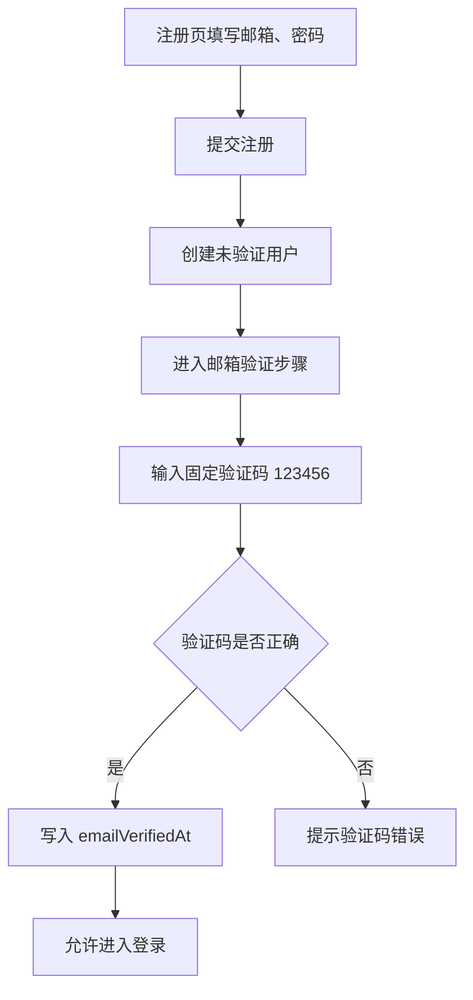
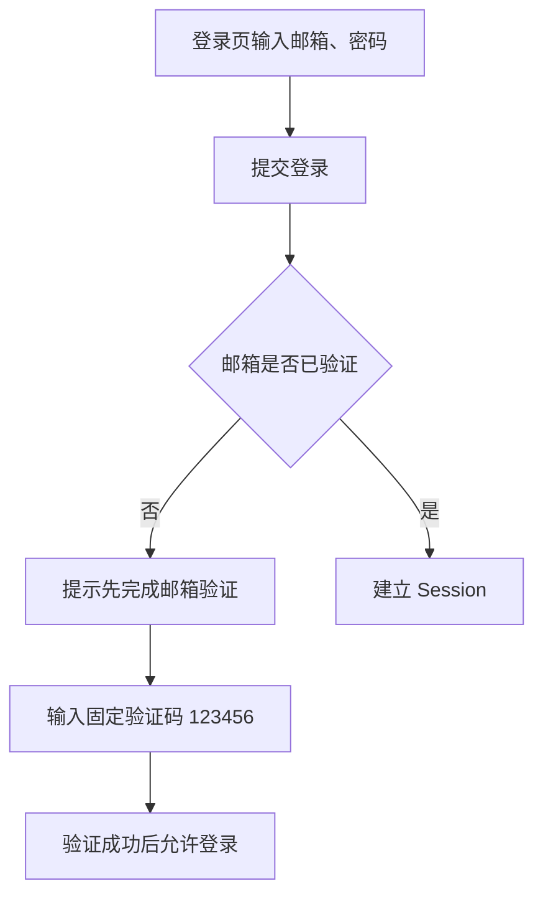
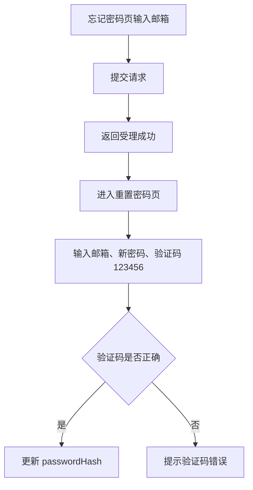

# SmartTag 认证联调模式补充

> 优先级：高
> 创建时间：2026-06-05 16:18
> 修改时间：2026-06-05 16:18
> 创建人：Codex

## 1. 文档目标

本文档用于补充并覆盖 SmartTag 首版在认证链路上的最新决策。

适用范围：

1. 注册
2. 邮箱验证
3. 登录
4. 找回密码
5. 重置密码

本文档优先级高于此前设计稿中“认证邮件真实发送”相关表述。

## 2. 最新决策

### 2.1 认证能力范围

首版保留以下能力：

1. 邮箱密码登录
2. 邮箱注册验证
3. 找回密码

### 2.2 联调模式约定

当前阶段不对接任何邮件厂商。

统一约定：

1. 邮箱验证固定验证码为 `123456`
2. 找回密码固定验证码为 `123456`
3. 前端页面仍保留“发送验证码”或“发送邮件”的交互入口
4. 后端接口只返回受理成功，不实际发送邮件

## 3. 用户状态模型

### 3.1 用户状态

首版用户状态只区分两类：

1. `未验证邮箱`
2. `已验证邮箱`

### 3.2 数据落地

`User` 模型保留：

1. `email`
2. `passwordHash`
3. `emailVerifiedAt`
4. `preferredLocale`
5. `timezone`

当前不新增邮箱验证码表，也不新增密码重置令牌表。

原因：

1. 当前验证码固定且不真实发送
2. 首版目标是先打通页面和接口联调
3. 避免过早引入无实际使用价值的 token 模型

## 4. 页面流程调整

### 4.1 注册流程



### 4.2 登录流程



### 4.3 找回密码流程



## 5. 接口约定

### 5.1 保留接口

保留以下接口：

1. `POST /api/auth/register`
2. `POST /api/auth/login`
3. `POST /api/auth/logout`
4. `POST /api/auth/verify-email/request`
5. `POST /api/auth/verify-email/confirm`
6. `POST /api/auth/forgot-password`
7. `POST /api/auth/reset-password`

### 5.2 接口行为

#### `POST /api/auth/verify-email/request`

行为：

1. 校验邮箱格式
2. 返回请求已受理
3. 不实际发送邮件

#### `POST /api/auth/verify-email/confirm`

请求体建议：

```json
{
  "email": "owner@example.com",
  "code": "123456"
}
```

行为：

1. `code === 123456` 则视为验证成功
2. 成功后写入 `emailVerifiedAt`
3. 错误时返回 `INVALID_VERIFICATION_CODE`

#### `POST /api/auth/forgot-password`

行为：

1. 校验邮箱格式
2. 返回请求已受理
3. 不实际发送邮件

#### `POST /api/auth/reset-password`

请求体建议：

```json
{
  "email": "owner@example.com",
  "code": "123456",
  "newPassword": "new-password-123"
}
```

行为：

1. `code === 123456` 则允许重置密码
2. 成功后更新 `passwordHash`
3. 错误时返回 `INVALID_VERIFICATION_CODE`

## 6. 前端交互建议

### 6.1 注册页

建议：

1. 注册提交成功后直接显示验证码输入区域
2. 页面文案明确写“当前联调验证码为 123456”

### 6.2 登录页

建议：

1. 未验证用户在登录页直接补验证码
2. 不必强制跳单独验证页

### 6.3 忘记密码页与重置密码页

建议：

1. 忘记密码页只负责收邮箱与展示下一步说明
2. 重置密码页负责输入验证码和新密码

## 7. 风险与后续升级

### 7.1 当前风险

1. 固定验证码只适合联调和内测
2. 不能用于真实生产环境
3. 无法提供真实邮件送达能力

### 7.2 后续升级路径

后续如需切回真实邮件模式，建议按以下顺序升级：

1. 接入邮件厂商
2. 把固定验证码改为动态验证码或 token
3. 增加验证码/令牌存储表
4. 增加过期时间与频率限制

## 8. 结论

当前认证链路建议按照“真实页面流程 + mock 验证码实现”的方式推进。

这样可以在不接入邮件厂商的前提下，先完成：

1. 页面联调
2. 表单校验
3. Session 登录态
4. OpenAPI 与 Prisma 对齐
