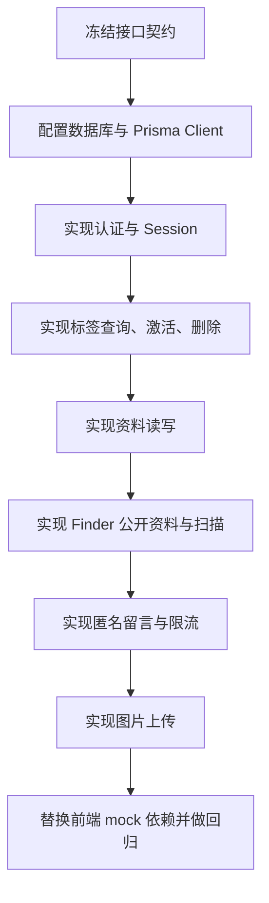

# SmartTag 真实接口契约冻结

> 优先级：高
> 创建时间：2026-06-10 11:27
> 修改时间：2026-06-10 11:27
> 创建人：Codex

## 1. 文档目标

本文用于冻结 SmartTag 从 mock API 进入真实接口开发前的接口口径。后续真实后端、Prisma 数据访问、前端请求类型和 OpenAPI 维护都以本文为基线。

当前结论：可以进入真实接口开发，但先不直接推翻现有 mock API，而是以现有页面已跑通的行为为主，补齐数据库、错误码、分页和上传契约。

## 2. 范围

本轮冻结覆盖以下接口：

| 模块 | 接口 |
| --- | --- |
| 认证 | `POST /api/auth/register`、`POST /api/auth/login`、`POST /api/auth/logout`、`GET /api/auth/me`、邮箱验证、找回/重置密码 |
| 主人端标签 | `GET /api/tags/my`、`POST /api/tags/activate`、`DELETE /api/tags/:id`、状态更新、资料读写 |
| 主人端记录 | `GET /api/tags/:id/scans`、`GET /api/tags/:id/messages` |
| Finder | `GET /api/tags/public/:uid`、`POST /api/tags/public/:uid/scan`、`POST /api/tags/public/:uid/message` |
| 上传 | `POST /api/uploads/image` |

官网页面不纳入本轮真实接口改造范围。

## 3. 统一响应结构

成功响应：

```json
{
  "success": true,
  "data": {},
  "meta": {
    "requestId": "req_1717990000000",
    "timestamp": "2026-06-10T03:27:00.000Z"
  }
}
```

失败响应：

```json
{
  "success": false,
  "error": {
    "code": "BAD_REQUEST",
    "message": "参数错误"
  },
  "meta": {
    "requestId": "req_1717990000000",
    "timestamp": "2026-06-10T03:27:00.000Z"
  }
}
```

前端判断必须依赖 `error.code`，不能依赖 `message` 文案。

## 4. 字段与枚举口径

### 4.1 语言字段映射

前端 i18n 使用：

| 前端值 | Prisma 值 |
| --- | --- |
| `zh-CN` | `ZH_CN` |
| `en` | `EN` |
| `ja` | `JA` |

接口入参和出参优先使用前端值 `zh-CN/en/ja`，真实数据库访问层负责映射到 Prisma 枚举。

### 4.2 集合字段

真实接口统一使用 `items` 作为集合字段。

分页接口允许在过渡阶段同时返回：

```json
{
  "items": [],
  "list": [],
  "pagination": {
    "page": 1,
    "pageSize": 20,
    "total": 0,
    "totalPages": 0
  }
}
```

其中 `list` 仅作为兼容字段，后续新代码只读 `items`。

### 4.3 分页默认值

| 接口 | 默认 `pageSize` | 最大 `pageSize` |
| --- | ---: | ---: |
| `GET /api/tags/:id/scans` | 5 | 100 |
| `GET /api/tags/:id/messages` | 5 | 100 |

`GET /api/tags/my` 首版真实接口先保持当前前端契约：返回当前账号全部标签 `items`，暂不强制分页。

## 5. 错误码冻结

| 错误码 | HTTP | 说明 |
| --- | ---: | --- |
| `BAD_REQUEST` | 400 | 参数缺失或格式错误 |
| `UNAUTHORIZED` | 401 | 未登录或登录失效 |
| `FORBIDDEN` | 403 | 无权访问资源 |
| `TAG_NOT_FOUND` | 404 | 标签不存在 |
| `USER_NOT_FOUND` | 404 | 用户不存在 |
| `PROFILE_NOT_FOUND` | 404 | 标签资料不存在 |
| `INVALID_CREDENTIALS` | 401 | 邮箱或密码错误 |
| `EMAIL_NOT_VERIFIED` | 403 | 邮箱未验证 |
| `EMAIL_ALREADY_EXISTS` | 409 | 邮箱已注册 |
| `EMAIL_ALREADY_VERIFIED` | 409 | 邮箱已验证 |
| `INVALID_VERIFICATION_CODE` | 400 | 邮箱验证码错误 |
| `TAG_ALREADY_BOUND` | 409 | 标签已被其他用户绑定 |
| `INVALID_ACTIVATION_CODE` | 400 | 激活码错误 |
| `DISPLAY_NAME_REQUIRED` | 400 | 标签资料展示名称为空 |
| `RATE_LIMITED` | 429 | 请求过于频繁 |
| `IMAGE_REQUIRED` | 400 | 未上传图片 |
| `UNSUPPORTED_IMAGE_TYPE` | 400 | 图片类型不支持 |
| `IMAGE_TOO_LARGE` | 400 | 图片超过大小限制 |
| `MESSAGE_CREATE_FAILED` | 500 | 匿名留言保存失败 |
| `INTERNAL_ERROR` | 500 | 服务端内部错误 |

旧文档中的 `INVALID_PARAMS` 与 `UPLOAD_NOT_ALLOWED` 不再作为真实开发首选错误码；如果历史兼容需要，可在网关或客户端映射到 `BAD_REQUEST` 和具体上传错误码。

## 6. 认证接口冻结

### 6.1 注册

`POST /api/auth/register`

请求：

```json
{
  "email": "new-owner@smarttag.local",
  "password": "Password123",
  "preferredLocale": "zh-CN"
}
```

响应：

```json
{
  "success": true,
  "data": {
    "user": {
      "id": 2,
      "email": "new-owner@smarttag.local",
      "emailVerifiedAt": null,
      "preferredLocale": "zh-CN"
    },
    "nextStep": "VERIFY_EMAIL"
  }
}
```

真实实现要求：

- 密码必须入库为哈希，不保存明文。
- 注册成功后首版可以继续使用固定验证码或开发验证码；生产前必须替换成邮件验证码表和发送服务。

### 6.2 登录

`POST /api/auth/login`

响应中的用户字段：

```json
{
  "id": 1,
  "email": "owner@smarttag.local",
  "preferredLocale": "zh-CN",
  "emailVerifiedAt": "2026-06-10T03:27:00.000Z"
}
```

真实实现要求：

- 使用 HttpOnly Cookie Session。
- 登录失败统一返回 `INVALID_CREDENTIALS`，不区分邮箱不存在和密码错误。
- 未验证邮箱返回 `EMAIL_NOT_VERIFIED`。

### 6.3 邮箱验证和找回密码

首版接口沿用当前页面契约：

| 接口 | 成功响应 |
| --- | --- |
| `POST /api/auth/verify-email/request` | `{ "accepted": true, "mockMode": true }` |
| `POST /api/auth/verify-email/confirm` | `{ "user": { "id": 1, "email": "...", "emailVerifiedAt": "..." } }` |
| `POST /api/auth/forgot-password` | `{ "accepted": true, "mockMode": true }` |
| `POST /api/auth/reset-password` | `{ "message": "密码重置成功" }` |

后续真实邮件服务接入时，响应结构不再暴露验证码。

## 7. 标签接口冻结

### 7.1 我的标签

`GET /api/tags/my`

首版响应：

```json
{
  "success": true,
  "data": {
    "items": []
  }
}
```

### 7.2 激活标签

`POST /api/tags/activate`

特殊成功场景：

```json
{
  "success": true,
  "data": {
    "tag": {},
    "alreadyOwned": true
  }
}
```

说明：如果标签已属于当前用户，真实接口返回成功而不是错误，方便前端直接进入资料编辑页。

### 7.3 删除标签

`DELETE /api/tags/:id`

响应：

```json
{
  "success": true,
  "data": {
    "tag": {}
  }
}
```

真实实现要求：

- 只允许标签主人删除。
- 删除标签时级联删除资料、扫描记录、匿名留言。
- 若后续引入审计需求，可改为软删除，但首版按硬删除实现。

## 8. 主人端记录接口冻结

### 8.1 扫描记录

`GET /api/tags/:id/scans?page=1&pageSize=5&locationSource=GPS&notificationStatus=SENT`

筛选参数：

| 参数 | 可选值 |
| --- | --- |
| `locationSource` | `GPS`、`IP` |
| `notificationStatus` | `PENDING`、`SENT`、`FAILED`、`SKIPPED` |

响应数据使用 `items + pagination`。

### 8.2 匿名留言

`GET /api/tags/:id/messages?page=1&pageSize=5&deliveryStatus=PENDING`

筛选参数：

| 参数 | 可选值 |
| --- | --- |
| `deliveryStatus` | `PENDING`、`SENT`、`FAILED` |

响应数据使用 `items + pagination`。

## 9. Finder 接口冻结

### 9.1 公开资料

`GET /api/tags/public/:uid`

隐私规则：

- `privacyMode = false`：可以返回 `ownerPhone`、`backupPhone`。
- `privacyMode = true`：不能返回真实电话，只允许 `canSendMessage = true`。
- `showHomeAddress = false` 时不能返回 `homeAddress`。
- 永远不返回 `activationCode`、主人端内部主键、完整邮箱地址。

### 9.2 扫描记录

`POST /api/tags/public/:uid/scan`

真实实现要求：

- 记录 `ipAddress`、`userAgent`。
- `GPS` 模式有经纬度时生成 `mapUrl`。
- 同一 `tagId + ipAddress` 1 分钟内重复扫描：仍写入扫描日志，但 `notificationStatus = SKIPPED`，`notificationSuppressed = true`。

### 9.3 匿名留言

`POST /api/tags/public/:uid/message`

真实实现要求：

- 仅 `privacyMode = true` 时允许提交。
- `message` 必填，首版最大 800 字符。
- 同一 `uid + ipAddress` 5 分钟内限流，返回 `RATE_LIMITED`。
- 成功后写入 `PrivacyMessage`，首版 `deliveryStatus = PENDING`。

## 10. 上传接口冻结

`POST /api/uploads/image`

请求字段统一为 `image`：

```text
multipart/form-data
image: File
```

限制：

| 项目 | 规则 |
| --- | --- |
| 类型 | `image/jpeg`、`image/png`、`image/webp` |
| 大小 | `<= 5MB` |
| 鉴权 | 必须登录 |

真实实现建议：

1. 开发环境先落本地 `public/uploads/tag-profile/` 或 `.data/uploads/`。
2. 返回可被前端直接展示的 URL。
3. 生产环境再切换到 S3 / Cloudflare R2。

## 11. 真实后端落地顺序



## 12. 待真实开发确认项

| 项目 | 建议 |
| --- | --- |
| 数据库 | MySQL，沿用 `prisma/schema.prisma` |
| 密码哈希 | `bcrypt` 或 `argon2`，优先 `argon2` |
| Session 存储 | 首版可签名 Cookie；多人/生产建议数据库或 Redis Session |
| 限流存储 | 开发环境可内存；生产建议 Redis |
| 邮件服务 | 先保留 mockMode；生产前接 SMTP/Resend/SES |
| 上传存储 | 开发本地目录，生产对象存储 |

## 13. 验收标准

1. OpenAPI 与本文一致，至少覆盖新增删除、留言列表、扫描过滤、上传错误码。
2. 真实接口返回结构与当前前端页面可直接对接。
3. 所有失败响应都包含稳定 `error.code`。
4. Finder 公开接口不泄露隐私字段。
5. 删除、扫描、留言限流、上传这些会修改数据的接口有最小回归用例。
