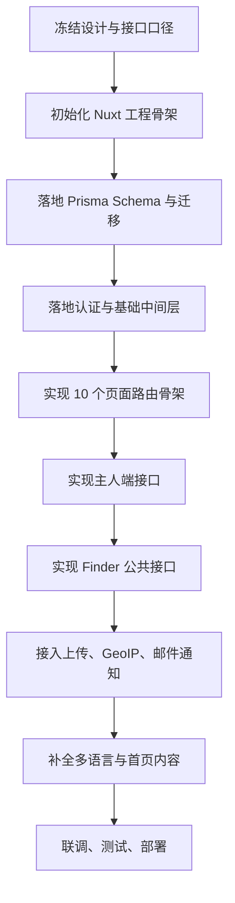

# SmartTag 实施前置清单与落地顺序

> 优先级：高
> 创建时间：2026-06-05 14:38
> 修改时间：2026-06-05 14:38
> 创建人：Codex

## 1. 文档目标

本文档用于承接当前已经完成的设计阶段产出，明确 SmartTag 首版在正式开始页面、接口与数据库开发之前，还需要完成哪些前置事项，以及推荐的实际落地顺序。

本文档默认基于以下既有结论继续推进：

- 技术栈采用 `Nuxt 3 + Vue 3 + TypeScript + Pinia + @nuxtjs/i18n + Prisma + MySQL + Redis`
- 首版共 `8` 个技术路由页面
- 一个账号可绑定多个防丢牌
- 标签状态固定为 `INACTIVE / ACTIVE / LOST`
- Finder 页在 `LOST` 状态顶部显示红色横幅 `I AM LOST, PLEASE HELP!`
- 首版支持 `zh-CN / en / ja`
- OpenAPI / Swagger 首版已产出
- Prisma `schema.prisma` 草案已产出

## 2. 当前已完成项

### 2.1 设计资产已具备

当前已经具备可直接指导开发的设计文档：

1. 核心流程与隐私策略
2. 技术方案
3. 接口设计
4. 页面清单与状态流转
5. 接口通用规范
6. OpenAPI 首版
7. Prisma Schema 草案

### 2.2 已冻结的关键业务规则

以下内容建议视为首版已冻结，不再反复摇摆：

1. 主人先扫码绑定，发现者后扫码查看公开信息
2. 数据结构统一兼容宠物与物品，不拆独立宠物表
3. `Show Location` 打开地图，定位点为发现者当前位置
4. 隐私模式首版采用布尔模式：
   `privacyMode = false` 为直接展示联系方式
   `privacyMode = true` 为匿名留言转发
5. 扫描日志保留 GPS / IP / UA / 去重通知相关字段
6. 同一 `tagId + ipAddress` 在 `1` 分钟内重复扫描不重复通知

### 2.3 已确认的实施决策

以下内容已由当前讨论明确，可直接执行：

1. 直接在当前仓库根目录初始化 `Nuxt 3`
2. 首页信息架构与表达方式参考 [Meouwow 官网](https://meouwow.com/)
3. 首版认证范围包含：
   - 邮箱密码登录
   - 邮箱注册验证
   - 找回密码
4. 当前认证联调模式不对接邮件厂商
5. 邮箱验证与找回密码固定验证码为 `123456`
6. 开发目录结构按当前方案执行
7. 继续对齐 `OpenAPI` 与 `schema.prisma`
8. 当前所有环境先统一为本地开发模式

## 3. 实施前还需要做的事

### 3.1 必做项

这些事项建议在正式开始开发前收口，否则后面容易返工：

1. 对齐 `OpenAPI` 与 `schema.prisma`
   - 字段命名是否完全一致
   - 可空字段是否一致
   - 枚举值是否完全一致
   - 返回结构是否和页面实际消费一致

2. 明确开发阶段目录结构
   - `pages`
   - `components`
   - `stores`
   - `server/api`
   - `server/services`
   - `server/repositories`
   - `server/utils`
   - `i18n/locales`

### 3.2 建议补充项

这些不是绝对阻塞项，但越早定越省事：

1. 首页三语文案细稿
2. 错误码展示文案的三语版本
3. 地图链接格式规范
4. 图片尺寸与裁剪规则
5. 本地 mock 的扫码提醒展示策略
6. 后续云资源接入顺序

## 4. 还缺哪些文档

从“能设计”到“能直接开工”，建议再补以下文档或补充内容：

1. 页面级低保真草图或区块清单
   - 尤其是 `/t/[uid]`
   - `/tags/[uid]/edit`
   - `/dashboard/tags/[uid]`

2. OpenAPI examples 补全
   - 目前已经有首版规范
   - 但仍建议补齐关键成功/失败示例

3. 环境变量说明文档
   - 便于后续开发、测试、部署共用

4. 数据迁移策略说明
   - 首版如何初始化未激活标签数据
   - `activationCode` 如何预生成

## 5. 推荐落地顺序

### 5.1 总体顺序

### 5.2 第一阶段：工程初始化

建议先完成：

1. 初始化 `Nuxt 3 + TypeScript`
2. 接入 `Pinia`
3. 接入 `@nuxtjs/i18n`
4. 建立统一目录结构
5. 建立 `eslint / prettier` 或团队代码规范
6. 建立 `.env.example`

阶段产出应包括：

1. 可运行的 Nuxt 项目
2. 10 个页面空路由骨架
3. 三语语言包初始文件

### 5.3 第二阶段：数据层落地

建议先完成：

1. 校验并修正 `schema.prisma`
2. 生成第一版 migration
3. 建立 Prisma Client 封装
4. 准备标签种子数据策略

阶段产出应包括：

1. 可迁移数据库结构
2. 可执行的 Prisma 基础读写
3. 初始化标签数据方案

### 5.4 第三阶段：基础能力

建议先完成：

1. Session 鉴权
2. 登录、注册、验证码校验、找回密码接口
3. 统一错误响应封装
4. 请求参数校验层
5. 上传能力基础封装

阶段产出应包括：

1. 主人端可登录
2. 服务端已具备受保护接口能力
3. 统一接口返回结构可复用

### 5.5 第四阶段：核心业务链路

建议按下面顺序实现：

1. `POST /api/tags/activate`
2. `PATCH /api/tags/{id}/profile`
3. `GET /api/tags/my`
4. `PATCH /api/tags/{id}/status`
5. `GET /api/tags/{id}/scans`
6. `GET /api/tags/public/{uid}`
7. `POST /api/tags/public/{uid}/scan`
8. `POST /api/tags/public/{uid}/message`

原因是：

1. 主人先能绑定，后面 Finder 才有数据可看
2. 资料先能编辑，公开页才能稳定展示
3. 扫码日志和匿名留言依赖前面的标签与资料数据

### 5.6 第五阶段：前端页面联调

建议按下面顺序联调页面：

1. `/auth/register`
2. `/auth/login`
3. `/auth/forgot-password`
4. `/auth/reset-password`
5. `/tags/[uid]/activate`
6. `/tags/[uid]/edit`
7. `/dashboard/tags`
8. `/dashboard/tags/[uid]`
9. `/t/[uid]`
10. `/`

说明：

1. 首页虽然是门面，但不阻塞核心业务联调
2. `/t/[uid]` 是最复杂页面，建议放在后段结合真实接口一起联调
3. 首页最后做，可以把真实功能状态、FAQ、CTA 一并对齐

## 6. 页面、接口、Prisma 的衔接关系

### 6.1 页面先后关系

1. 激活页依赖登录和激活接口
2. 编辑页依赖标签已绑定和资料接口
3. 标签详情页依赖状态切换和扫描历史接口
4. Finder 页依赖公开资料接口、扫描上报接口、匿名留言接口

### 6.2 数据表优先级

建议优先级如下：

1. `User`
2. `Tag`
3. `TagProfile`
4. `ScanLog`
5. `PrivacyMessage`

原因是：

1. `User` 和 `Tag` 是激活绑定主链路
2. `TagProfile` 是公开展示主数据
3. `ScanLog` 和 `PrivacyMessage` 属于发现者侧行为数据

## 7. 首版实施中的关键风险

### 7.1 业务风险

1. 激活码策略如果没有定清楚，会卡住实际绑定流程
2. 隐私模式如果后续改成多档位，会影响字段设计和接口返回
3. 首页三语文案如果不提前准备，容易拖慢上线节奏

### 7.2 技术风险

1. 浏览器定位权限不稳定，必须接受 GPS 失败并走 IP 兜底
2. 邮件服务不稳定时，不能阻塞 Finder 页展示
3. OpenAPI、页面状态机、Prisma 字段如果不完全一致，联调时会反复改

## 8. 建议的最近三步

如果现在继续往下推进，最顺的三步是：

1. 先补首页信息架构与三语文案草案
2. 再初始化 `Nuxt 3` 工程骨架和 10 个页面路由
3. 然后根据 `OpenAPI + Prisma` 开始搭 `server/api`

## 9. 结论

当前项目已经完成了“需求到设计”的核心收口，下一步不再是继续抽象讨论，而是进入“工程骨架初始化 -> 数据层落地 -> 接口实现 -> 页面联调”的开发阶段。

如果希望我继续直接往下做，最推荐的起点是：

1. 初始化 `Nuxt 3` 项目骨架
2. 建好 `i18n`、`Pinia`、`server/api`、`prisma` 目录
3. 先把 10 个页面路由和基础布局跑起来
