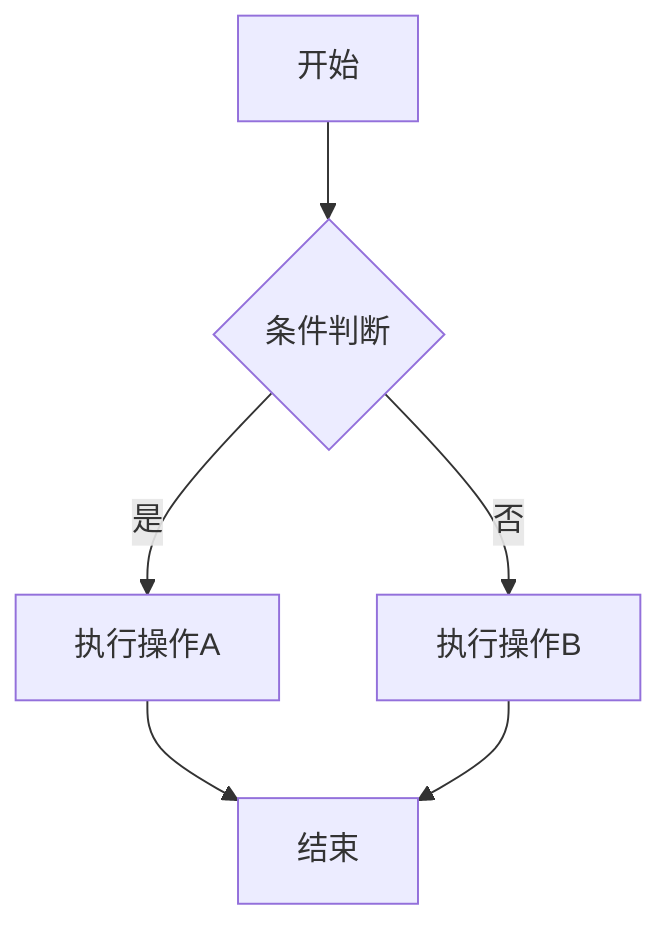
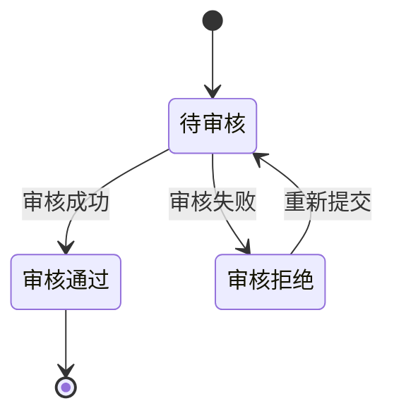
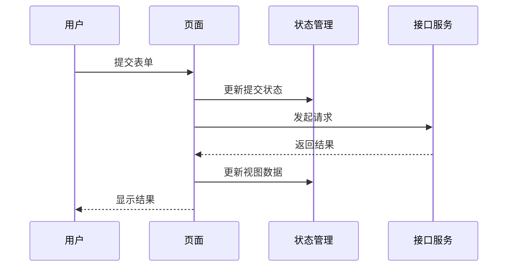

# 文档管理规范

> 优先级：高（全局生效）
> 创建时间：2026-01-13 12:30
> 修改时间：2026-04-24 18:00
> 创建人：usha


## 1. 文档目录结构

### 1.1 核心目录结构

```
docs/
├── 01_需求/          # 需求文档
├── 02_设计/          # 技术方案、架构设计
├── 03_开发指南/       # 开发指南、流程分析
├── 04_任务追踪/       # task分解、进度记录
├── 05_交接归档/       # 交接文档、总结
├── 06_功能开发/       # 功能开发子任务
├── 07_代码审查/       # 代码审查
├── assets/           # 图片、附件等资源
├── logs/             # 对话日志
└── _archive/         # 废弃文档
```

### 1.2 目录说明

| 目录 | 用途 | 文档类型 |
|------|------|----------|
| 01_需求/ | 存放需求文档 | 需求分析、用户故事、用例文档 |
| 02_设计/ | 存放设计文档 | 业务逻辑、技术架构、交互设计 |
| 03_开发指南/ | 存放开发指南 | 开发流程、编码规范、环境配置 |
| 04_任务追踪/ | 存放任务追踪文档 | 任务分解、进度记录、问题跟踪 |
| 05_交接归档/ | 存放交接文档 | 工作交接、项目总结、成果归档 |
| 06_功能开发/ | 存放功能开发文档 | 需求、技术方案、task分解 |
| 07_代码审查/ | 存放代码审查文档 | 需求逻辑、审查报告、问题跟踪 |
| assets/ | 存放资源文件 | 图片、截图、附件 |
| logs/ | 存放对话日志 | 交互记录、操作历史 |
| _archive/ | 存放废弃文档 | 过时文档、历史版本 |

## 2. 文档命名规范

### 2.1 通用命名格式

```
{YYYYMMDD}_{HHMM}_{文档类型}_{文档名称}.md
```

### 2.2 命名说明

| 组成部分 | 格式 | 示例 | 说明 |
|---------|------|------|------|
| YYYYMMDD | 年月日 | 20260127 | 创建日期 |
| HHMM | 时分 | 1030 | 创建时间 |
| 文档类型 | 中文 | 需求 | 文档类别 |
| 文档名称 | 中文 | 用户权限管理 | 文档主题 |

### 2.3 示例

- `20260127_1030_需求_用户权限管理.md`
- `20260127_1045_设计_技术架构.md`
- `20260127_1100_开发指南_环境配置.md`

### 2.4 版本管理

当文档需要更新时：
1. 保留原文档不动
2. 创建新文档，使用新时间戳
3. 在文件名中添加版本说明

示例：
- `20260127_1030_设计_技术架构.md` ← 原始版本
- `20260127_1430_设计_技术架构_v2.md` ← 第二版
- `20260128_0900_设计_技术架构_v3.md` ← 第三版

## 3. 文档内容规范

### 3.1 文档头部

所有文档必须包含以下头部信息：

```markdown
# 文档标题

> 优先级：[高/中/低]
> 创建时间：YYYY-MM-DD HH:mm
> 修改时间：YYYY-MM-DD HH:mm
> 创建人：usha

## 1. 文档内容
```

### 3.2 文档结构

根据文档类型，应包含以下内容：

#### 3.2.1 需求文档
- 功能概述
- 需求背景
- 功能点详细说明
- 验收标准
- 风险评估

#### 3.2.2 设计文档
- 业务逻辑
- 技术架构
- 接口对接说明（记录接口用途、请求参数、响应示例、mock 数据与字段映射）
- 页面与交互设计
- 实现方案
#### 3.2.3 开发指南
- 环境配置
- 开发流程
- 编码规范
- 部署说明
- 常见问题

#### 3.2.4 代码审查文档
- 需求回顾
- 代码分析
- 问题发现
- 优化建议
- 审查结论

### 3.3 格式要求

- 使用Markdown格式
- 标题层级清晰
- 代码块使用 ``` 包裹
- 表格使用Markdown表格语法
- 图片使用相对路径或统一资源路径
- **流程图使用Mermaid语法**（详见3.4节）

### 3.4 Mermaid流程图规范

当文档中包含流程、状态流转、架构关系等示意图时，**必须使用Mermaid语法**绘制。

#### 3.4.1 支持的图表类型

| 图表类型 | 语法 | 适用场景 |
|----------|------|----------|
| 流程图 | `flowchart` | 业务流程、操作步骤 |
| 时序图 | `sequenceDiagram` | 接口调用、系统交互 |
| 状态图 | `stateDiagram` | 状态流转、生命周期 |
| 类图 | `classDiagram` | 类结构、实体关系 |
| 甘特图 | `gantt` | 项目进度、任务计划 |

#### 3.4.2 流程图示例



#### 3.4.3 状态图示例



#### 3.4.4 时序图示例



#### 3.4.5 Mermaid语法规范

| 规范项 | 说明 |
|--------|------|
| 方向 | TD（从上到下）、LR（从左到右）、BT（从下到上）、RL（从右到左） |
| 节点形状 | `[]`矩形、`()`圆角矩形、`{}`菱形、`(())`圆形 |
| 连接线 | `-->`实线、`-.->`虚线、`==>`粗线 |
| 标签 | `A-->|标签|B` 或 `A--标签-->B` |
| 子图 | `subgraph 名称 ... end` |

## 4. 文档管理流程

### 4.1 文档创建流程

1. **需求确认**：确认文档需求和范围
2. **目录选择**：选择合适的文档目录
3. **文档创建**：按照命名规范创建文档
4. **内容编写**：按照内容规范编写文档
5. **文档审核**：相关人员审核文档
6. **文档发布**：发布到对应目录

### 4.2 文档更新流程

1. **需求分析**：分析需要更新的内容
2. **版本管理**：创建新版本文档
3. **内容更新**：更新文档内容
4. **修改记录**：记录修改内容
5. **文档审核**：审核更新后的文档
6. **文档发布**：发布新版本文档

### 4.3 文档归档流程

1. **评估**：评估文档是否需要归档
2. **迁移**：将文档移动到_archive目录
3. **标记**：在文件名中添加归档标记
4. **记录**：记录归档原因和时间

## 5. 指令操作规范

### 5.1 文档创建指令

| 指令 | 格式 | 功能 | 输出目录 |
|------|------|------|----------|
| `/design` | `/design {功能名称}` | 创建业务设计文档 | `02_设计/` |
| `/dev` | `/dev {Task序号} {功能名称}` | 创建功能开发文档 | `06_功能开发/` |
| `/review` | `/review {Task序号} {功能名称}` | 创建代码审查文档 | `07_代码审查/` |
| `/handover` | `/handover` | 生成交接归档文档 | `05_交接归档/` |

#### 5.1.1 指令模板与生成内容（前端项目专用）

下面为每个指令的参数说明、生成文件名规则与模板示例，便于前端同学快速创建标准化文档。

- /design
    - 格式：`/design {功能名称}`
    - 输出目录：`02_设计/`
    - 文件名：`{YYYYMMDD}_{HHMM}_设计_{功能名称}.md`
    - 模板（生成内容示例）：

        # {功能名称} 设计文档

        > 优先级：中/高
        > 创建时间：YYYY-MM-DD HH:mm
        > 创建人：xxx

        ## 1. 概述
        - 功能简介、目标用户、使用场景

        ## 2. 页面/组件设计
        - 页面流程、关键组件、交互示意
        - 视觉/样式说明（参考设计稿）

        ## 3. 接口与数据约定
        - 接口列表（接口名称、用途、文档链接）
        - 请求/响应示例、字段映射、mock 示例

        ## 4. 数据与状态管理
        - 本地状态、全局 store、缓存策略

        ## 5. 兼容与适配
        - 支持的系统/分辨率、降级策略

        ## 6. 验收标准
        - 功能点、边界条件、性能要求

        ## 7. 任务分解（可迁移为 /dev 的 task）

- /dev
    - 格式：`/dev {Task序号} {功能名称}`
    - 输出目录：`06_功能开发/`
    - 文件名：`{YYYYMMDD}_{HHMM}_开发_{Task序号}_{功能名称}.md`
    - 模板：

        # Task {Task序号} - {功能名称}

        > 创建时间：YYYY-MM-DD HH:mm
        > 负责人：xxx

        ## 1. 任务描述
        - 详细功能点、输入输出

        ## 2. 实现细节
        - 组件分解、路由变更、样式、状态管理、依赖库

        ## 3. 接口调用（mock/示例）
        - 使用的接口、请求示例、mock 数据、异常态处理

        ## 4. 测试用例
        - 校验点与预期

        ## 5. 验收标准与完成判断

- /review
    - 格式：`/review {Task序号} {功能名称}`
    - 输出目录：`07_代码审查/`
    - 文件名：`{YYYYMMDD}_{HHMM}_审查_{Task序号}_{功能名称}.md`
    - 模板：

        # 代码审查 - Task {Task序号} {功能名称}

        > 审查时间：YYYY-MM-DD HH:mm
        > 审查者：xxx

        ## 1. 需求回顾
        - 简要说明需求要点

        ## 2. 审查范围
        - 涉及文件/模块/关键实现点

        ## 3. 问题与建议
        - 列表化问题（代码风格、性能、安全、可维护性）

        ## 4. 风险与影响评估

        ## 5. 跟进任务

- /handover
    - 格式：`/handover`
    - 输出目录：`05_交接归档/`
    - 文件名：`{YYYYMMDD}_{HHMM}_交接_项目或功能名称.md`
    - 模板：

        # 交接归档（功能/项目）

        > 交接时间：YYYY-MM-DD HH:mm
        > 交接人：xxx

        ## 1. 功能清单与当前状态
        - 列出功能、完成度、已知问题

        ## 2. 已有文档清单与位置
        - 设计、开发、测试、接口文档链接

        ## 3. 部署/打包说明
        - 打包产物位置、release 流程、注意事项

        ## 4. 环境与配置
        - 环境变量、第三方 key、mock 服务说明（敏感信息不要直接写入）

        ## 5. 联系人列表
        - 前端负责人、测试、产品

        ## 6. 交接附件
        - 设计稿、接口文档、测试用例、其他资源

> 注：所有由 `/design`、`/dev`、`/review`、`/handover` 生成的文档，均应遵循头部模板（见 3.1 节），并使用时间戳命名以便版本管理；如涉及接口信息，请统一记录接口用途、参数约定、响应字段与 mock 示例。

### 5.2 执行流程

1. **指令识别**：识别用户输入的指令
2. **参数验证**：验证指令参数是否完整
3. **需求确认**：对复杂需求进行确认
4. **目录创建**：创建必要的文档目录
5. **文档生成**：生成标准格式的文档
6. **内容填充**：填充文档内容
7. **结果反馈**：反馈文档创建结果

## 6. 注意事项

1. **统一规范**：所有文档必须遵循统一的命名和结构规范
2. **及时更新**：文档内容应及时更新，保持与实际情况一致
3. **版本管理**：通过时间戳和版本号管理文档版本
4. **分类存储**：按照功能和类型分类存储文档
5. **权限控制**：根据需要设置文档访问权限
6. **备份管理**：定期备份重要文档
7. **清理过期**：定期清理过期和无用的文档
8. **保持整洁**：保持文档目录结构清晰整洁
9. **流程图规范**：流程、状态、架构等示意图必须使用Mermaid语法，便于版本控制和协作
